# WAPH-Web Application Programming and Hacking

## Instructor: Dr. Phu Phung

## Student

**Name**: Sophia Munoz

**Email**: [mailto:munozsa@mail.uc.edu](munozsa@mail.uc.edu)


# Individual Project 1 - Professional Profile Website

## The Project's Overview

For Individual Project 1 there were three tasks. Task 1 has two parts. In Part `a`, I create and deployed a personal website using GitHub Pages, as in the GitHub Cloud. This website includes information about me, including background. In Part `b`, I created a link to a new HTML page \(`waph.html`) with the course overview and current projects.

Task 2 has two parts. In Part `a` I used React, Bootstrap, and Vite. I used an existing template to guide me in the implementation of my website. In Part `b` I integrated the google analytics page tracker into my `index.html` file to track user patterns.

Task 3 has three parts. In Part `a` I used jQuery and React to implement JavaScript code. This included a digital clock, analog clock, show/hide email function, and fact generator. In Part `b` I integrated two public Web APIs: jokeAPI \(every minute) and Weatherbit.io. In Part `c` I implemented JavaScript cookies to track users and welcome them with a notification.

Outcomes I learned from this project were the implentations of third-party APIs \(JokeAPI, Weatherbit.io, Useless Facts API) in React. I also made sure to keep security in mind by using env variables for API keys. I also learned about managing rate limits \(especially for Weatherbit.io). I also learned how to add new components to integrate my functions into the webpage.

Portfolio Website: [https://munozsophia.github.io](https://munozsophia.github.io)

Individual Project 1 Repository: [https://github.com/munozsophia/munozsophia.github.io](https://github.com/munozsophia/munozsophia.github.io)

### Task 1. General Requirements

#### a. Personal Website Deployment

I created my website by using a React-Bootstrap template. The About Me section includes my name and my background.

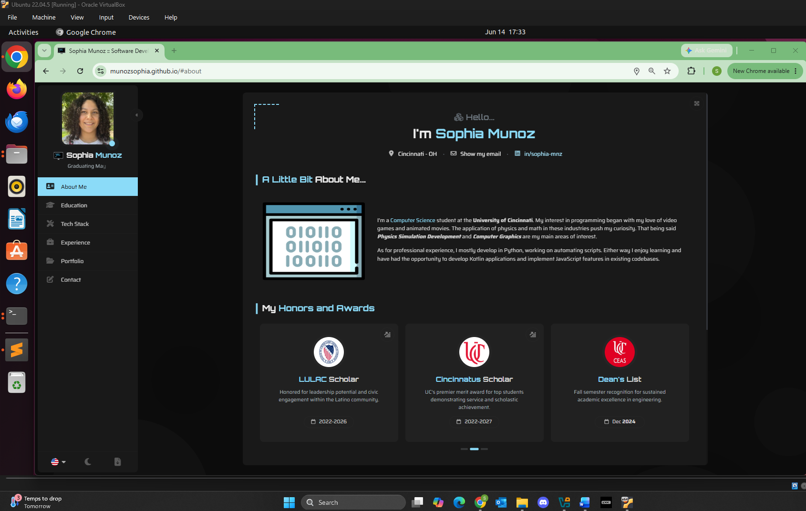
*About Me Section*

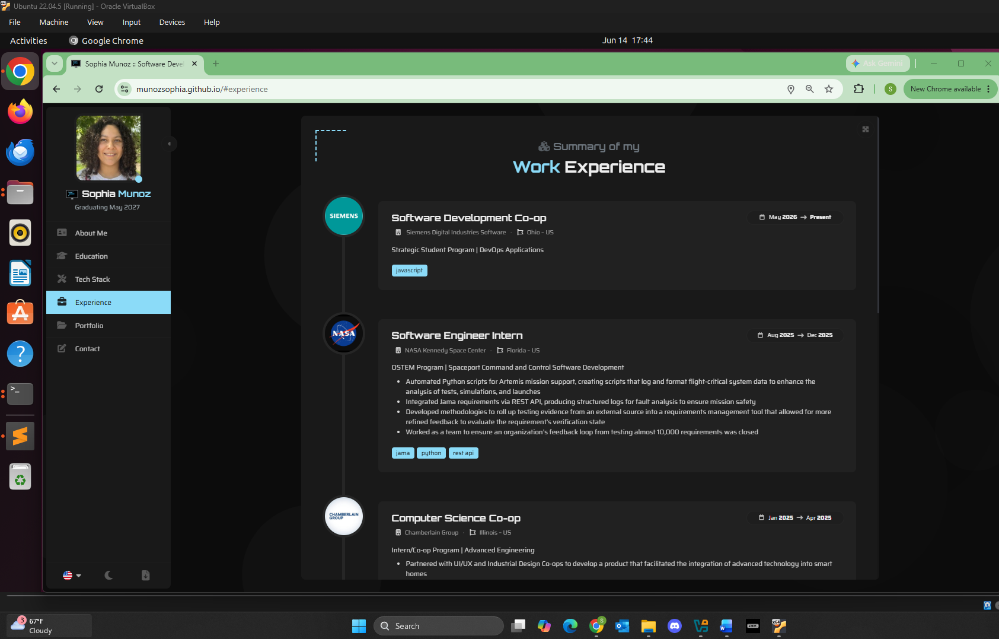
*Experience Section*

#### b. WAPH HTML Page

I created another HTML page \(`waph.html`), which is an overview of the `Web Application Programming and Hacking` course. This page also covers current labs and hackathons in the course.

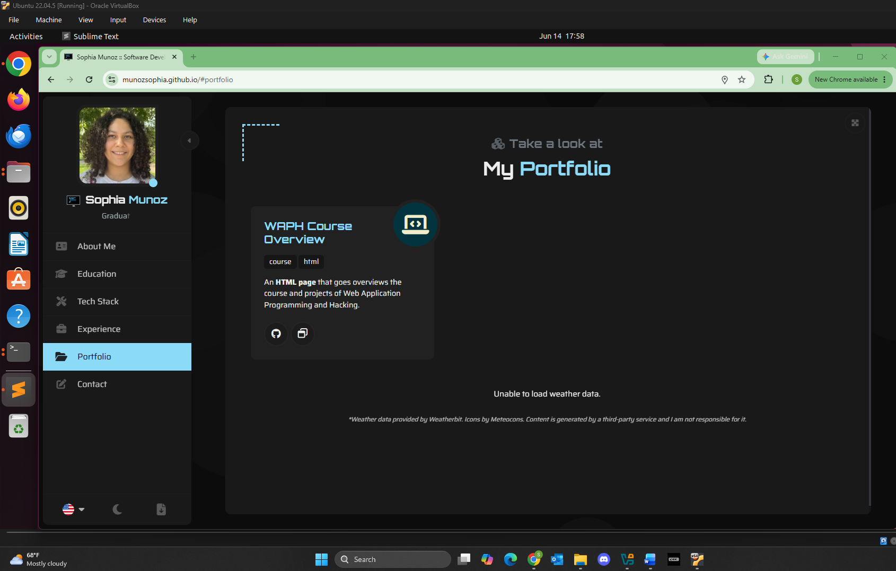
*WAPH Course Link in Portfolio*

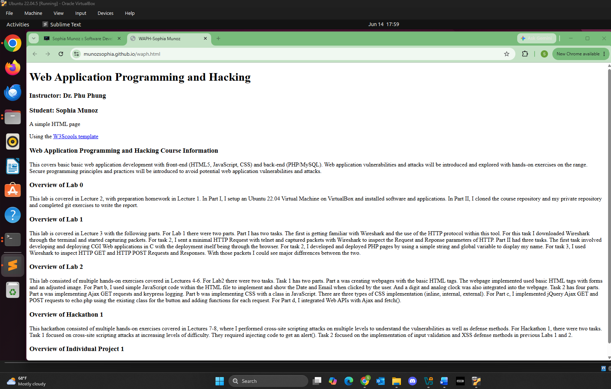
*WAPH Course Page*

### Task 2. Non-Technical Requirements

#### a. Open-Source CSS Framework (Bootstrap)

As for the implementation of the template, the website is built using a React template. This template uses Bootstrap 5 for the layout and component styling. This framework was a great guide to implementing my portfolio as professional and informative.

#### b. Page Tracker

I decided to integrate the page tracker using Google Analytics. The documentation had me paste the code below into the `index.html` file. Since Google Analytics doesn't provide a way to implement images withing a website I shared my Realtime Dashboard from Google Analytics of my website visits.

```html
<!-- Google tag (gtag.js) -->
<script async src="https://www.googletagmanager.com/gtag/js?id=G-QMX396Z1QJ"></script>
<script>
  window.dataLayer = window.dataLayer || [];
  function gtag(){dataLayer.push(arguments);}
  gtag('js', new Date());
  gtag('config', 'G-QMX396Z1QJ');
</script>
```

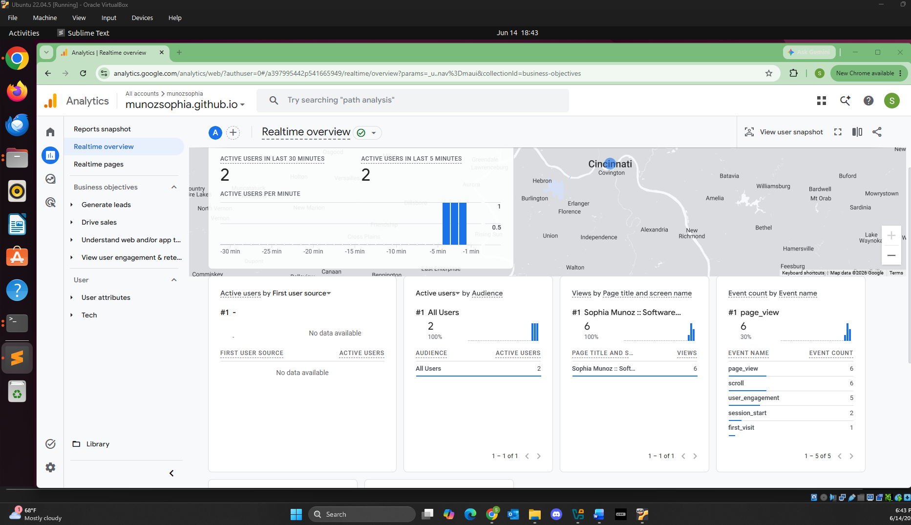
*Google Analytics Realtime Dashboard*

### Task 3. Technical Requirements

#### a. Basic JavaScript Code (jQuery and React)

##### i. Digital Clock

I created a new `ArticleClock` component to implement a digital clock. I used `useState`, `useEffect`, and `setInterval` to essentially imitate the `displayTime()` function in Lab 2 as a React component.

```jsx
const [time, setTime] = useState(new Date())
 
useEffect(() => {
    const interval = setInterval(() => {
        setTime(new Date())
    }, 1000)
 
    return () => clearInterval(interval)
}, [])
```

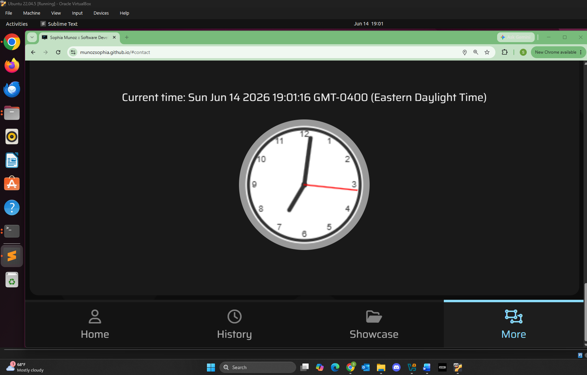
*Digital Clock*

##### ii. Analog Clock

For the analog clock, I used similar functions from Lab 2's `clock.js`, except they are implemented as functions inside the `ArticleClock` component. The functions are:

- `drawFace()`
- `drawNumbers()`
- `drawTime()`

I also had hook `useEffect` redrawn each second as the seconds hand ticked.

```jsx
const drawTime = (ctx, radius) => {
    const now = time
    let hour = now.getHours()
    let minute = now.getMinutes()
    let second = now.getSeconds()
 
    hour = hour % 12
    hour = (hour * Math.PI / 6) + (minute * Math.PI / (6 * 60)) + (second * Math.PI / (360 * 60))
    drawHand(ctx, hour, radius * 0.5, radius * 0.07, '#333')
    // ...minute and second hands follow the same pattern
}
```


*Analog Clock*

##### iii. showHide Email

I implemented the showHide email function with an onClick as an inline element in `ArticleInlineList`. To do this I updated the component to add the functionality if the element has an `fa-email` icon and is located in the `cover.json` section \(About Me). In this case I used the React states to achieve this part.

```jsx
const [emailVisible, setEmailVisible] = useState(false)
 
if (showHideEmail) {
    return (
        <li className={`article-inline-list-item text-4`}
            onClick={(e) => { if (!emailVisible) { e.preventDefault(); setEmailVisible(true) } }}>
            <Link href={emailVisible ? itemWrapper.link?.href : null}>
                <span>{emailVisible ? itemWrapper.label : language.getString("show_my_email")}</span>
            </Link>
        </li>
    )
}
```

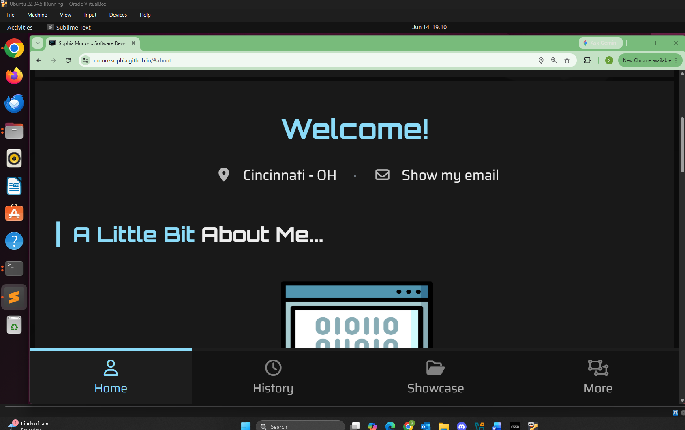
*Email Hidden*

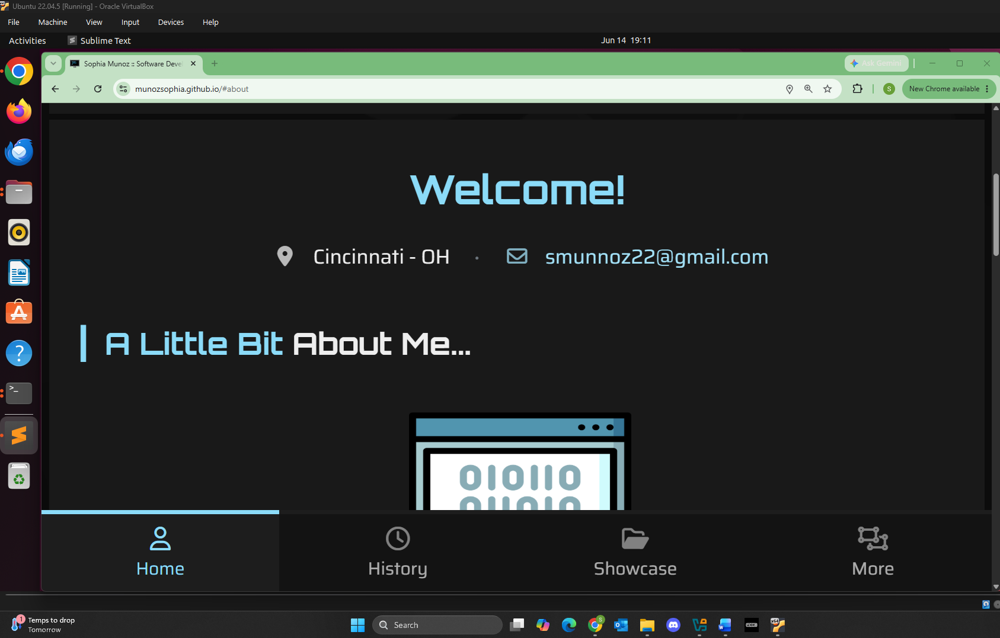
*Email Shown*

##### iv. Random Fact Generator

For the functionality of my choice, I chose to implement the fact generator using [Useless Facts API](https://uselessfacts.jsph.pl/). As previously mentioned for the other implementations, I created an `ArticleFactGenerator` component. I used jQuery's `$.get()` and added a button to generate a new fact onClick.

```jsx
const fetchFact = () => {
    setLoading(true)
    $.get("https://uselessfacts.jsph.pl/api/v2/facts/random?language=en",
        function(result) {
            if (!result || !result.text) {
                setLoading(false)
                return
            }
            setFact(result.text)
            setLoading(false)
        }
    ).fail(function() {
        setLoading(false)
    })
}
```

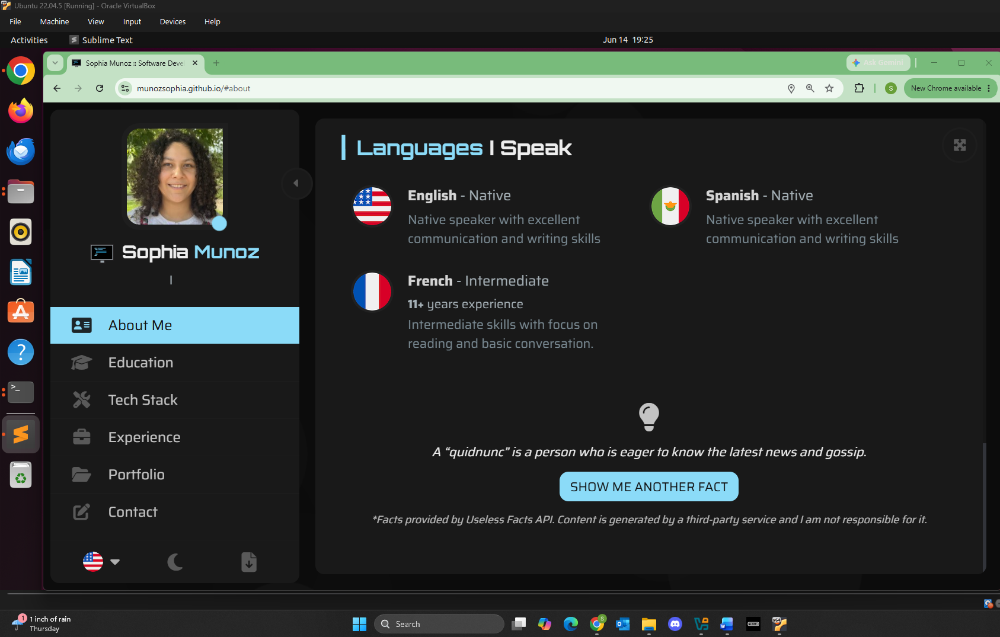
*Fact Generator*

#### b. Public Web API Integration

##### i. JokeAPI Integration

As for the Public Web JokeAPI, I create a new `ArticleJoke` component to generate a single-type joke every minute using `setInterval(fetchJoke, 60000)`. I also managed to implement this API using jQuery's `$.get()`.

```jsx
const fetchJoke = () => {
    $.get("https://v2.jokeapi.dev/joke/Any?type=single",
        function(result) {
            if (!result || !result.joke) return
            setJoke(result.joke)
        }
    )
}
 
useEffect(() => {
    fetchJoke()
    const interval = setInterval(fetchJoke, 60000)
    return () => clearInterval(interval)
}, [])
```

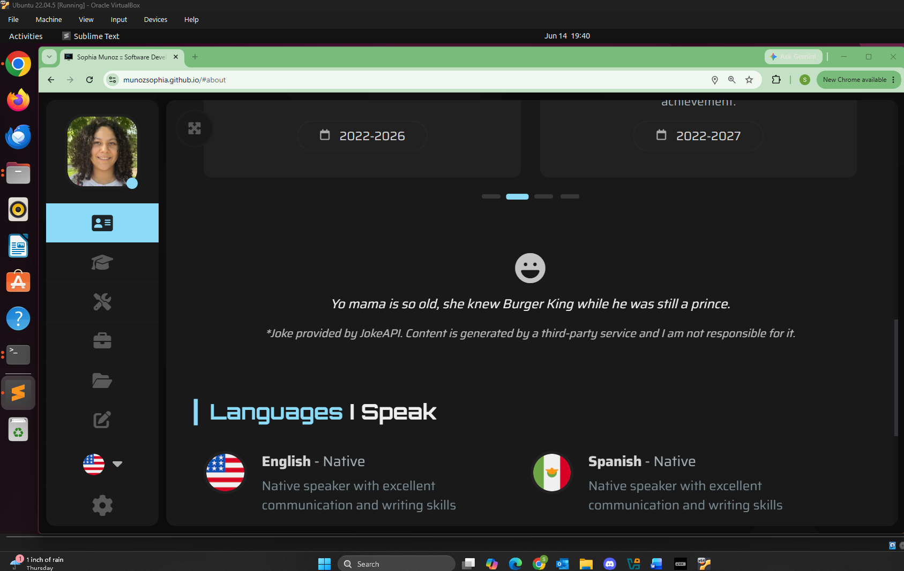
*Web JokeAPI Integration*

##### ii. Weatherbit API Integration

For the Weatherbit API integration, its implementation was successful. I created a `ArticleWeather` component to implement the Current Weather API. I ran into an issue where I eventually could not display the image but I figured out that I had to fix a deployment pipeline isse and now it works. I just have to make sure to deploy with this workflow from now on.

- npm run build
- npm run deploy
- git add .
- git commit -m "update"
- git push

I also used Meteocons, which are animated graphics that I mapped to Weatherbit. Also since I used a generated Master API Key I took security measures to keep the API Key unexposed to the public repo. I stored it in an `.env`.

```jsx
const fetchWeather = (lat, lon) => {
    fetch(`https://api.weatherbit.io/v2.0/current?lat=${lat}&lon=${lon}&key=${apiKey}&units=I`)
        .then(response => response.json())
        .then(result => {
            if (!result || !result.data || !result.data[0]) {
                setError("Unable to load weather data.")
                return
            }
            setWeather(result.data[0])
        })
        .catch(() => setError("Unable to load weather data."))
}
```

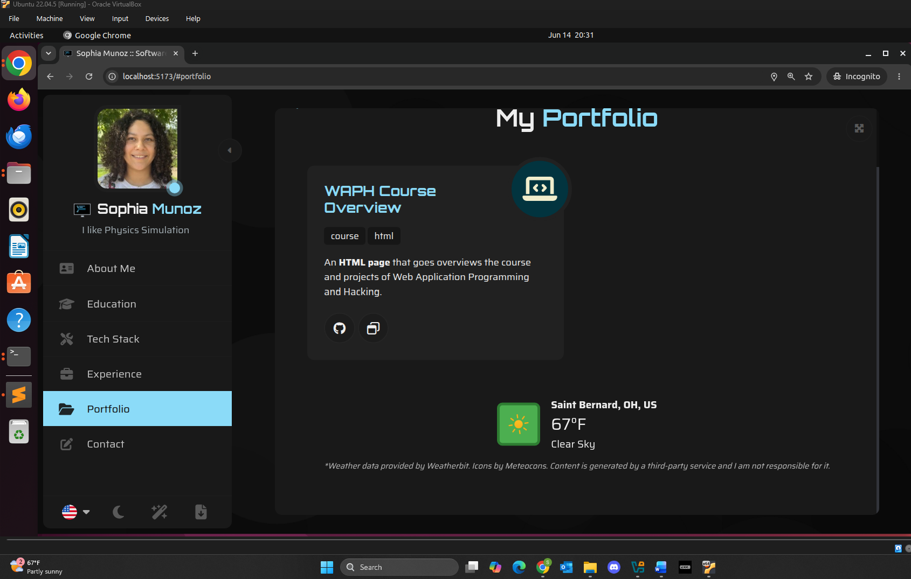
*Web Weatherbit.io Integration*

#### c. JavaScript Cookies

As for the JavaScript cookie implementation, I created a handler, `WelcomeCookieHandler` component that uses `document.cookie` to check if there is a `lastVisit=` cookie that already exists.

```jsx
if (document.cookie.indexOf("lastVisit") < 0) {
    displayNotification(
        language.getString("welcome"),
        language.getString("welcome_first_time"),
        "default"
    )
} else {
    const lastVisit = document.cookie
        .split('; ')
        .find(row => row.startsWith('lastVisit='))
        ?.split('=')[1]
 
    displayNotification(
        language.getString("welcome"),
        language.getString("welcome_back").replace("{date}", decodeURIComponent(lastVisit)),
        "default"
    )
}
 
document.cookie = `lastVisit=${encodeURIComponent(now)}; path=/; max-age=31536000`
```

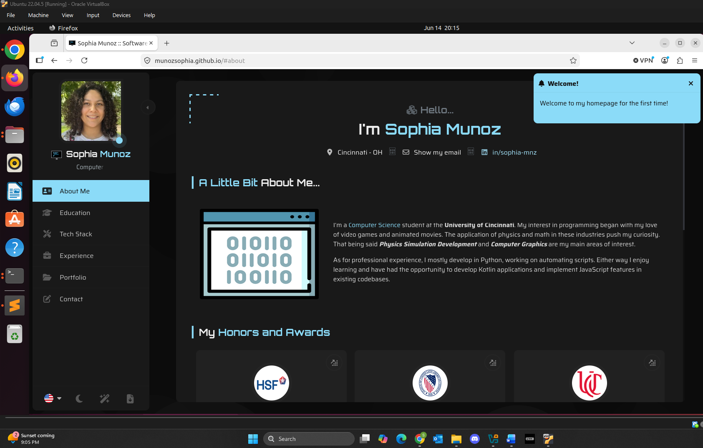
*First Visit Cookie Message*

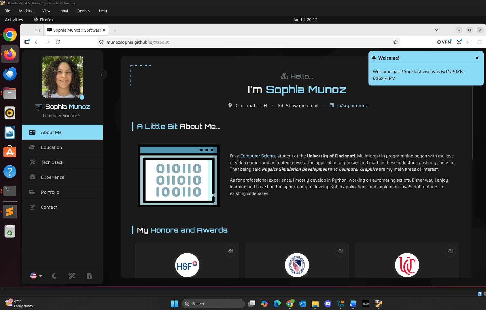
*Returning Visit Cookie Message*
