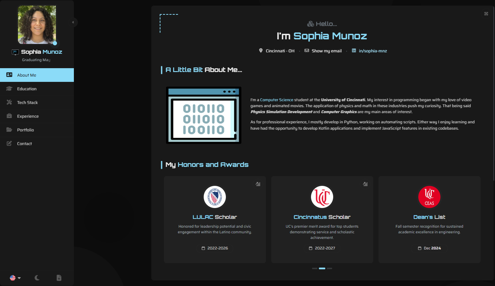

<div align="center">

# Sophia Munoz · Personal Portfolio

**Computer Science student at the University of Cincinnati · Graduating May 2027**

Interested in computer graphics, physics simulation and game development.

### 🌐 [munozsophia.github.io](https://munozsophia.github.io)

[](https://react.dev/)
[](https://vite.dev/)
[](https://getbootstrap.com/)
[](https://sass-lang.com/)
[](https://munozsophia.github.io)



</div>

---

## What's inside

| Section | What it shows |
| --- | --- |
| **About Me** | Background, interests, and honors & awards |
| **Education** | University of Cincinnati and Walnut Hills |
| **Tech Stack** | Languages, frameworks, and tools |
| **Experience** | Co-ops and internships at NASA, Chamberlain Group, BMW, Siemens, and P&G |
| **Portfolio** | Course pages for *Web Application Programming and Hacking* and *Computer Graphics I* |
| **Contact** | A contact form that sends straight to my inbox |

## Features

- 🌎 **Three languages**: English, Español and Français, switchable from the sidebar
- 🌗 **Light / dark theme** toggle
- 📄 **One-click resume** download
- 🌤️ **Live weather** from the [Weatherbit.io](https://www.weatherbit.io/) API, with animated Meteocons
- 😄 **A new joke every minute** from [JokeAPI](https://jokeapi.dev/)
- 💡 **Random fact generator** using the [Useless Facts API](https://uselessfacts.jsph.pl/)
- 🕒 **Digital and analog clocks** (the analog one is drawn on a `<canvas>`)
- 🍪 **Welcome-back message** that uses a cookie to remember your last visit
- ✉️ **Contact form** powered by [EmailJS](https://www.emailjs.com/)
- 📈 **Google Analytics** page tracking

## Tech stack

**Frontend:** React 18, React-Bootstrap / Bootstrap 5, Sass, jQuery, Swiper  
**Tooling:** Vite, ESLint, gh-pages  
**APIs:** Weatherbit.io, JokeAPI, Useless Facts, EmailJS

## Run it locally

You need [Node.js](https://nodejs.org/) (LTS version).

```bash
git clone https://github.com/munozsophia/munozsophia.github.io.git
cd munozsophia.github.io
npm install
npm run dev
```

The weather widget needs a free Weatherbit API key. Create a `.env` file in the project root:

```bash
VITE_WEATHERBIT_API_KEY=your_key_here
```

> `.env` is git-ignored, so the key never ends up in the public repo.

| Command           | What it does                                   |
| ----------------- | ---------------------------------------------- |
| `npm run dev`     | Start the dev server with live reload          |
| `npm run build`   | Build the production site into `dist/`         |
| `npm run preview` | Preview the production build locally           |
| `npm run deploy`  | Publish `dist/` to GitHub Pages                |
| `npm run lint`    | Check the code with ESLint                     |

## Deploying

```bash
npm run build
npm run deploy
```

Then commit and push the source changes as usual.

## Editing content

Almost all of the site's content lives in JSON, so most updates don't need any code:

```
public/data/
├── profile.json      # name, photo, roles, resume link
├── sections.json     # which sections appear in the sidebar
├── categories.json   # sidebar groups
├── strings.json      # UI text in EN / ES / FR
└── sections/         # one file per section (cover, education, skills, experience, portfolio, contact)
```

Custom React components I added for this site live in `src/components/articles/`, including `ArticleClock`, `ArticleWeather`, `ArticleJoke`, and `ArticleFactGenerator`.

## Course work

This site was also my **Individual Project 1** for *Web Application Programming and Hacking* (Dr. Phu Phung):

- 📝 [Project 1 write-up](docs/waph-project-1.md)
- 📄 [Project 1 report (PDF)](munozsa-waph-project1.pdf)
- 🔗 [WAPH course page](https://munozsophia.github.io/waph.html) · [Computer Graphics I page](https://munozsophia.github.io/computer-graphics.html)

## Credits

Built on the open-source [React Portfolio Template](https://github.com/ryanbalieiro/react-portfolio-template) by **Ryan Balieiro** (MIT License). Customizations, content, API integrations, and the extra components listed above are my own.

## Contact

📧 [munozsa@mail.uc.edu](mailto:munozsa@mail.uc.edu) · 💼 [LinkedIn](https://www.linkedin.com/in/sophia-mnz) · 🐙 [@munozsophia](https://github.com/munozsophia)
